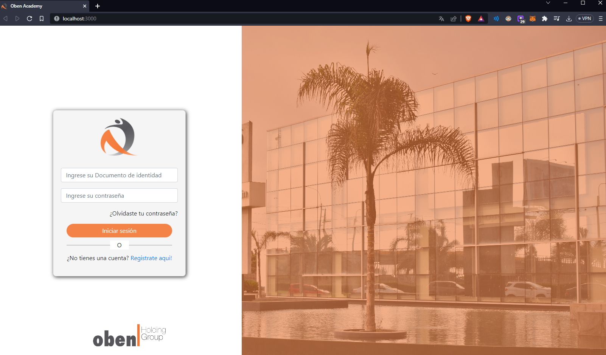
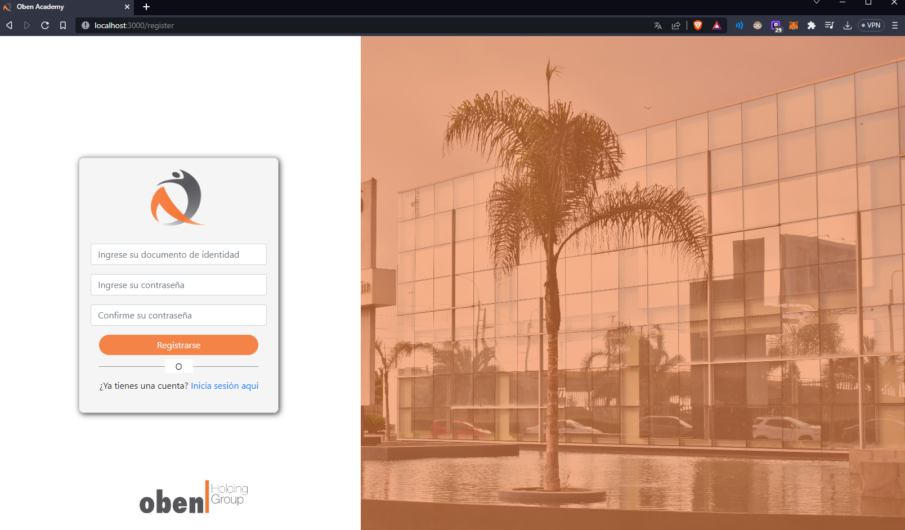

# Oben Academy - FrontEnd Side

> Este es el lado del proyecto en el cual esta enfocado el FrontEnd.

## INSTALACIÓN

```bash
# Instalamos las dependencias para este proyecto

npm install

```

```bash
# E iniciamos el proyecto con:
npm start
```
> La pagina se encuentra en: http://localhost:3000

## CAPTURAS

> Login



> Register

